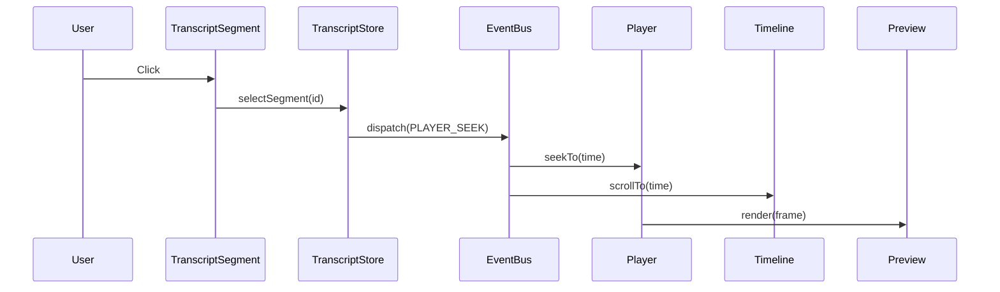
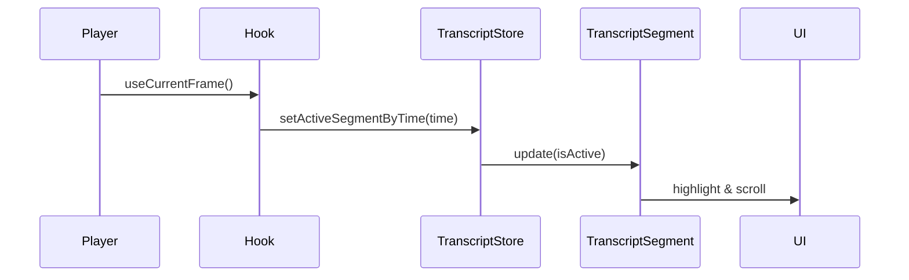

# PRD: 富文本字幕编辑器功能
Product Requirements Document

## 1. 产品概述

### 1.1 背景
当前视频编辑器缺少专业的字幕/文稿编辑功能。用户需要一个集成的富文本编辑器，能够：
- 编辑带时间轴的字幕文本
- 实现文本与视频时间轴的双向同步
- 支持基础的富文本格式化

### 1.2 目标
- 提供直观的字幕编辑体验
- 实现精确的时间轴同步
- 支持常见的字幕格式和样式
- 保持与现有编辑器架构的一致性

### 1.3 成功指标
- 文本选择到时间轴跳转延迟 < 100ms
- 支持处理 > 1000 个字幕段落不卡顿
- 字幕与视频同步误差 < 50ms

## 2. 用户故事

### 2.1 核心用户故事

#### US-001: 查看和编辑字幕
**作为**视频编辑者
**我想要**在编辑器中查看和编辑字幕文本
**以便**快速修改视频中的文字内容

**验收标准：**
- 能够查看所有字幕段落列表
- 能够编辑选中段落的文本
- 支持实时预览修改效果

#### US-002: 时间轴同步导航
**作为**视频编辑者
**我想要**点击字幕段落时自动跳转到对应时间
**以便**快速定位和预览特定内容

**验收标准：**
- 点击字幕段落，时间轴和预览自动跳转
- 播放视频时，对应字幕段落高亮显示
- 支持键盘快捷键导航（上/下段落）

#### US-003: 格式化字幕文本
**作为**视频编辑者
**我想要**为字幕添加格式（粗体、颜色等）
**以便**增强字幕的视觉效果

**验收标准：**
- 支持粗体、斜体、下划线
- 支持文字颜色和背景色
- 支持字体大小调整

### 2.2 高级用户故事

#### US-004: 调整字幕时间
**作为**视频编辑者
**我想要**调整字幕的显示时间范围
**以便**精确控制字幕出现的时机

#### US-005: 批量操作
**作为**视频编辑者
**我想要**批量修改多个字幕的样式
**以便**保持视觉一致性

## 3. 功能需求

### 3.1 编辑器布局

#### 3.1.1 面板位置
- **位置**：Scene（预览区）右侧，通过可调整分割条分隔
- **默认宽度**：占总宽度的 30%
- **最小宽度**：300px
- **最大宽度**：50% 总宽度

#### 3.1.2 布局结构
```
┌─────────────────────────────────────────────────┐
│                    Navbar                        │
├──────┬────────────────────┬──────────┬──────────┤
│      │                    │          │          │
│ Menu │     Scene          │Transcript│ Control  │
│ List │    (Preview)       │  Editor  │  Item    │
│      │                    │          │          │
├──────┴────────────────────┴──────────┴──────────┤
│                  Timeline                        │
└─────────────────────────────────────────────────┘
```

### 3.2 TranscriptEditor 组件

#### 3.2.1 组件结构
```
TranscriptEditor
├── TranscriptToolbar     // 格式化工具栏
├── TranscriptSearchBar   // 搜索栏
├── TranscriptList        // 段落列表
│   └── TranscriptSegment // 单个段落
└── TranscriptStatusBar   // 状态栏
```

#### 3.2.2 TranscriptToolbar 功能
- **格式按钮**：
  - Bold (Ctrl/Cmd+B)
  - Italic (Ctrl/Cmd+I)
  - Underline (Ctrl/Cmd+U)
  - 文字颜色选择器
  - 背景色选择器
  - 字体大小 (12-48px)
  - 对齐方式 (左/中/右)

- **操作按钮**：
  - 添加新段落
  - 删除段落
  - 分割段落
  - 合并段落

#### 3.2.3 TranscriptSegment 功能

**显示模式**：
```jsx
<div className="segment">
  <div className="time-badge">00:01.50 - 00:03.20</div>
  <div className="speaker-badge">Speaker 1</div>
  <div className="text-content">段落文本内容...</div>
</div>
```

**编辑模式**：
- ContentEditable div
- 保持格式化显示
- 自动保存（失焦或 500ms 无操作）
- ESC 取消编辑

**交互**：
- 单击：选中并跳转时间轴
- 双击：进入编辑模式
- 右键：上下文菜单
- 拖拽：调整段落顺序

### 3.3 数据模型

#### 3.3.1 TranscriptSegment
```typescript
interface TranscriptSegment {
  id: string;                    // 唯一标识
  text: string;                  // 纯文本内容
  html?: string;                 // 富文本HTML
  startTime: number;             // 开始时间(ms)
  endTime: number;               // 结束时间(ms)
  speaker?: string;              // 说话人
  isActive?: boolean;            // 是否为当前播放段落
  style?: {
    bold?: boolean;
    italic?: boolean;
    underline?: boolean;
    color?: string;             // hex color
    backgroundColor?: string;   // hex color
    fontSize?: number;          // px
    fontFamily?: string;
    textAlign?: 'left' | 'center' | 'right';
  };
}
```

### 3.4 同步机制

#### 3.4.1 文本 → 时间轴


#### 3.4.2 时间轴 → 文本


### 3.5 性能优化

#### 3.5.1 虚拟滚动
- 使用 react-window 或类似库
- 只渲染可见区域 +/- 5 个段落
- 动态高度计算

#### 3.5.2 防抖优化
- 文本输入：500ms 防抖
- 滚动同步：16ms 节流（60fps）
- 样式更新：立即应用，批量保存

#### 3.5.3 缓存策略
- 缓存已渲染的 HTML
- 缓存段落高度计算
- 使用 memo 优化重渲染

## 4. 技术架构

### 4.1 组件层级
```
Editor.tsx
├── ResizablePanelGroup (horizontal)
│   ├── Scene (70%)
│   └── TranscriptEditor (30%)
└── Timeline
```

### 4.2 状态管理

#### 4.2.1 Zustand Stores
- **useTranscriptStore**: 字幕数据和操作
- **useStore**: 共享播放状态
- **useLayoutStore**: UI 布局状态

#### 4.2.2 状态流
```
useTranscriptStore
  ├── segments[]
  ├── activeSegmentId
  ├── editingSegmentId
  └── methods
      ├── CRUD operations
      ├── Selection
      └── Synchronization
```

### 4.3 事件系统

#### 4.3.1 新增事件
```typescript
// Transcript specific events
export const TRANSCRIPT_SELECT = "TRANSCRIPT_SELECT";
export const TRANSCRIPT_UPDATE = "TRANSCRIPT_UPDATE"; 
export const TRANSCRIPT_SYNC = "TRANSCRIPT_SYNC";
export const TRANSCRIPT_STYLE_CHANGE = "TRANSCRIPT_STYLE_CHANGE";
```

#### 4.3.2 事件监听
```typescript
// use-transcript-sync.ts
useEffect(() => {
  // Listen to player time updates
  const subscription = playerEvents.subscribe((event) => {
    if (event.key === PLAYER_TIME_UPDATE) {
      transcriptStore.setActiveSegmentByTime(event.time);
    }
  });
  return () => subscription.unsubscribe();
}, []);
```

## 5. 实现计划

### 5.1 Phase 1: 基础功能（MVP）
**时间：3天**
- [x] 创建 TranscriptStore
- [x] 定义数据类型
- [ ] 实现 TranscriptEditor 容器
- [ ] 实现 TranscriptSegment 组件
- [ ] 集成到 Editor 布局
- [ ] 基础的点击跳转功能

### 5.2 Phase 2: 同步功能
**时间：2天**
- [ ] 实现双向同步机制
- [ ] 添加事件监听
- [ ] 自动滚动和高亮
- [ ] 键盘导航

### 5.3 Phase 3: 富文本编辑
**时间：2天**
- [ ] 实现工具栏
- [ ] 格式化功能
- [ ] 样式应用和保存
- [ ] 快捷键支持

### 5.4 Phase 4: 高级功能
**时间：3天**
- [ ] 时间调整功能
- [ ] 批量操作
- [ ] 搜索和替换
- [ ] 导入/导出

## 6. 测试计划

### 6.1 单元测试
- TranscriptStore 的所有方法
- 时间计算和同步逻辑
- 格式化功能

### 6.2 集成测试
- 与 Timeline 的同步
- 与 Player 的交互
- 事件系统

### 6.3 性能测试
- 1000+ 段落的渲染性能
- 滚动流畅度
- 内存使用

## 7. 风险和依赖

### 7.1 技术风险
- ContentEditable 的跨浏览器兼容性
- 大量段落的性能问题
- 与 Remotion 渲染的集成

### 7.2 依赖
- 现有的事件系统
- Zustand 状态管理
- ResizablePanel 组件

## 8. 未来扩展

### 8.1 短期（1-2个月）
- AI 自动生成字幕
- 多语言支持
- 字幕样式模板

### 8.2 长期（3-6个月）
- 协作编辑
- 语音识别集成
- 高级动画效果
- 专业字幕格式支持（SRT, VTT, ASS）

## 9. 成功标准

### 9.1 功能完整性
- ✅ 所有核心用户故事实现
- ✅ 无关键 bug
- ✅ 性能达标

### 9.2 用户体验
- 直观的交互设计
- 流畅的同步体验
- 快速的响应时间

### 9.3 代码质量
- 组件可复用
- 代码可维护
- 充分的测试覆盖